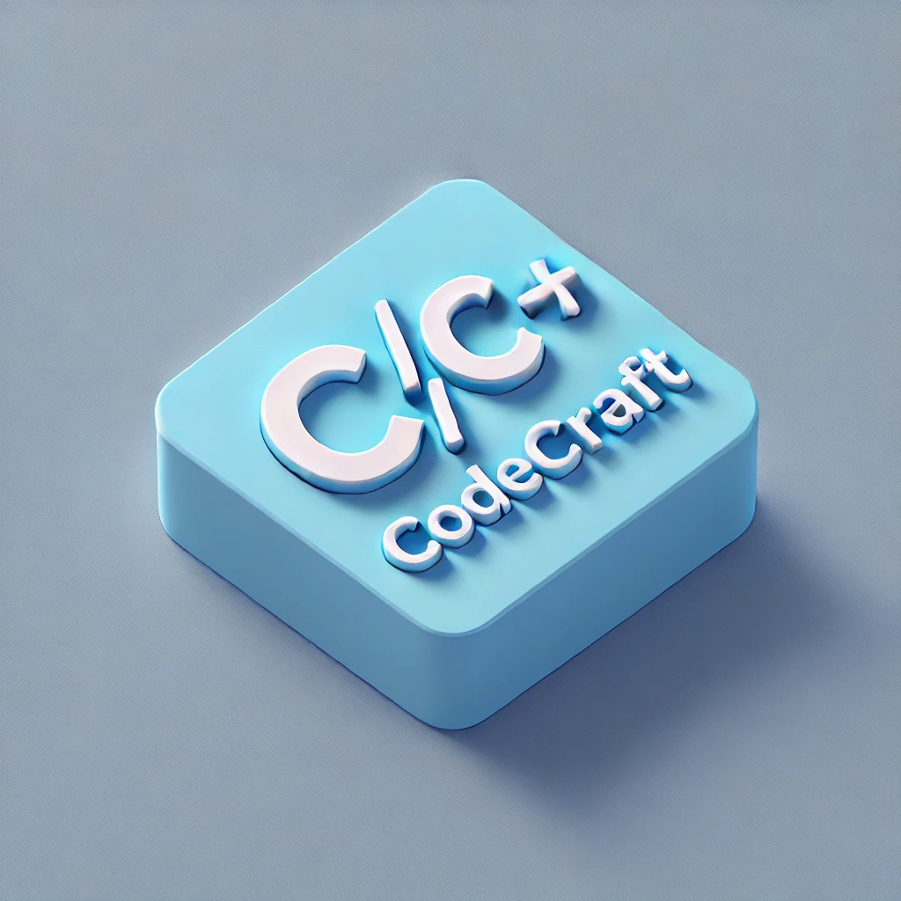

# C/C++ CodeCraft

**C/C++ CodeCraft** is a comprehensive collection of C and C++ code snippets designed to enhance productivity and simplify the development process. This extension provides easy-to-use and powerful code snippets that are aligned with the latest standards, including C23 and C++23.

## Features

- **C Code Snippets**: Quickly insert commonly used C constructs such as loops, conditionals, memory management, and file operations.
- **C++ Code Snippets**: Insert modern C++ constructs including smart pointers, lambdas, concepts, and range-based for loops.
- **Support for Latest Standards**: Snippets are up-to-date with the latest C23 and C++23 standards.
- **Easy to Use**: Just type the prefix `ccraft-` followed by the snippet name to insert the code.

## Installation

1. Open VS Code.
2. Go to the Extensions view by clicking on the Extensions icon in the Sidebar or by pressing `Ctrl+Shift+X`.
3. Search for `C/C++ CodeCraft`.
4. Click **Install** to install the extension.

## Usage

Once installed, you can use the snippets by typing their prefix in any `.c`, `.cpp`, or `.h` file. Here are the snippets available:

### C Snippets

- `ccraft-main`: Main function template
- `ccraft-for-loop`: Basic for loop
- `ccraft-if-else`: If-Else statement
- `ccraft-printf`: Printf function
- `ccraft-scanf`: Scanf function
- `ccraft-while-loop`: While loop
- `ccraft-struct`: Structure definition
- `ccraft-typedef`: Typedef statement
- `ccraft-pointer`: Pointer declaration
- `ccraft-malloc`: Memory allocation using malloc
- `ccraft-free`: Memory deallocation using free
- `ccraft-fopen`: File open using fopen
- `ccraft-fclose`: File close using fclose
- `ccraft-fwrite`: File write using fwrite
- `ccraft-fread`: File read using fread
- `ccraft-switch-case`: Switch-case statement
- `ccraft-do-while-loop`: Do-while loop
- `ccraft-define`: Define a macro
- `ccraft-include-guard`: Include guard for header files
- `ccraft-inline-function`: Inline function definition
- `ccraft-assert`: Assert statement

### C++ Snippets

- `ccraft-cpp-main`: C++ main function template
- `ccraft-cpp-for-loop`: Basic for loop
- `ccraft-cpp-if-else`: If-Else statement
- `ccraft-cpp-unique_ptr`: std::unique_ptr (C++11 and later)
- `ccraft-cpp-vector`: std::vector declaration
- `ccraft-cpp-class`: Basic class definition
- `ccraft-cpp-smart-ptr`: Smart pointer (std::unique_ptr and std::shared_ptr)
- `ccraft-cpp-concept`: Define a concept (C++20 and later)
- `ccraft-cpp-constexpr`: Constexpr function
- `ccraft-cpp-range-for`: Range-based for loop (C++11 and later)
- `ccraft-cpp-ranges`: Using ranges (C++20 and later)
- `ccraft-cpp-lambda`: Lambda expression (C++11 and later)
- `ccraft-cpp-try-catch`: Try-catch block
- `ccraft-cpp-std-thread`: Standard thread creation and joining (C++11 and later)
- `ccraft-cpp-std-optional`: std::optional usage (C++17 and later)
- `ccraft-cpp-std-variant`: std::variant usage (C++17 and later)
- `ccraft-cpp-enum-class`: Strongly typed enum class
- `ccraft-cpp-static-assert`: Static assert (C++11 and later)

## Contributing

Contributions are welcome! If you have any ideas or improvements, feel free to submit a pull request or open an issue.

### How to Contribute

1. Fork the repository on GitHub.
2. Create a new branch with your feature or bugfix.
3. Commit your changes and push the branch to your fork.
4. Open a pull request against the main repository.

## Issues

If you encounter any issues or bugs, please open an issue on our [GitHub Issues page](https://github.com/sitharaj88/codecraft-cpp/issues).

## License

This project is licensed under the Apache 2.0 License. See the [LICENSE](LICENSE) file for details.

## Author

**Sitharaj Seenivasan**  
[LinkedIn Profile](https://linkedin.com/in/sitharaj08)

---

Thank you for using **C/C++ CodeCraft**! Happy coding!
